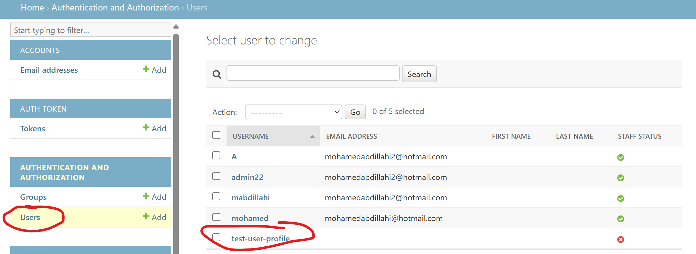

# FitShare API in DRF

**Developer: Master Mohamed Abdillahi**

💻 [Live link](https://fitshareapi-b9588b2c11b9.herokuapp.com/)

This repository contains the API set up using Django REST Framework for the FitShare front-end application ([repository here](https://github.com/yourgithub/fitshare) and [live website here](https://fitshare-d428ae7f1a9f.herokuapp.com/))

## Table of Contents
  - [User Stories](#user-stories)
  - [Database](#database)
  - [Technologies Used](#technologies-used)
  - [Validation](#validation)
  - [Testing](#testing)
  - [Deployment](#deployment)
  - [Credits](#credits)

## User Stories

The back-end section of the FitShare project focuses on its administration side and covers the following user stories:
- **Content Management:**  
  As an admin, I want to be able to create, edit, and delete users, posts, comments, and likes, so that I can have control over the content of the application and remove any inappropriate content.
- **Achievements Management:**  
  As an admin, I want to monitor and manage user achievements, so that I can track user engagement and reward users for their activity on the platform.

#### User Model

- The User model contains information about the user. It is part of the Django AllAuth library.
- One-to-one relation with the Profile model owner field.
- ForeignKey relation with the Follower model (owner and followed fields).
- ForeignKey relation with the Post model owner field.
- ForeignKey relation with the Comment model owner field.
- ForeignKey relation with the Like model owner field.

#### Profile Model

- The Profile model contains the following fields: `owner`, `name`, `content`, `created_at`, `updated_at`, and `image`.
- One-to-one relation between the `owner` field and the User model `id` field.
- Default profile image is used if no image is uploaded.

#### Post Model

- The Post model contains the following fields: `owner`, `created_at`, `updated_at`, `title`, `content`, `image`, and `image_filter`.
- ForeignKey relation with the Comment model `post` field.
- ForeignKey relation with the Like model `post` field.
- Includes options for image filters like `Hudson`, `Earlybird`, `Nashville`, and more.

#### Follower Model

- The Follower model contains the following fields: `owner`, `followed`, and `created_at`.
- ForeignKey relation between the `owner` field and the User model `id` field.
- ForeignKey relation between the `followed` field and the User model `id` field.
- Unique constraint ensures a user cannot follow the same user multiple times.

#### Comment Model

- The Comment model contains the following fields: `owner`, `post`, `created_at`, `updated_at`, and `content`.
- ForeignKey relation between the `owner` field and the User model `id` field.
- ForeignKey relation between the `post` field and the Post model `id` field.

#### Like Model

- The Like model contains the following fields: `owner`, `post`, and `created_at`.
- ForeignKey relation between the `owner` field and the User model `id` field.
- ForeignKey relation between the `post` field and the Post model `id` field.
- Unique constraint ensures a user cannot like the same post multiple times.

#### Achievement Model

- The Achievement model is a new custom model introduced to reward user engagement.
- **Fields:**
  - `user`: A ForeignKey linking the achievement to a specific User.
  - `title`: The name of the achievement (e.g., "Newbie", "Popular Post", "Comment Champion").
  - `description`: A short explanation of what the achievement represents.
  - `date_earned`: A DateTimeField that automatically records when the achievement was awarded.
- **Awarding Logic:**
  - **Newbie:** Awarded when a user creates their first post.
  - **Popular Post:** Awarded when a post receives at least 1 like or 1 comment (thresholds reduced for easier testing).
  - **Comment Champion:** Awarded when a user makes 2 or more comments.
- This model is managed automatically using Django signals, ensuring achievements are awarded based on user actions without manual intervention.


##### Back to [top](#table-of-contents)


## Database

The following models were created to represent the database model structure of the application:


## Technologies Used

### Languages & Frameworks

- Python
- Django

### Libraries & Tools

- [APITestCase](https://www.django-rest-framework.org/api-guide/testing/) - Django Rest Framework APITestCase was used for automated testing.
- [Cloudinary](https://cloudinary.com/) to store static files.
- [Coverage](https://coverage.readthedocs.io/en/6.4.4/) used to produce automated testing reports.
- [Dbdiagram.io](https://dbdiagram.io/home) used for the database schema diagram.
- [Git](https://git-scm.com/) was used for version control via Gitpod terminal to push the code to GitHub.
- [GitHub](https://github.com/) was used as a remote repository to store project code.
- [Gitpod](https://gitpod.io/workspaces) - a virtual IDE workspace used to build this site.
- [Render Platform](https://render.com) was used to deploy the project into a live environment.
- [Django REST Framework](https://www.django-rest-framework.org/) was used to build the back-end API.
- [Django AllAuth](https://django-allauth.readthedocs.io/en/latest/index.html) was used for user authentication.
- [Pillow](https://pillow.readthedocs.io/en/stable/) was used for image processing and validation.
- [Psycopg2](https://www.psycopg.org/docs/) was used as a PostgreSQL database adapter for Python.
- [PostgreSQL](https://www.postgresql.org/) – deployed project on Render uses a PostgreSQL database.

##### Back to [top](#table-of-contents)


## Validation

### PEP8 Validation
[PEP8](http://pep8online.com/) Validation Service was used to check the code for PEP8 requirements. All the code passes with no errors or warnings.

## Testing

Comprehensive testing was conducted to ensure the robustness and reliability of FitShare's functionality. The testing process included both manual and automated approaches to validate the application’s features and user stories.

---

### Manual Testing of User Stories

### Manual Testing of User Stories

The manual testing focused on verifying key functionalities of the application against the defined user stories. Each feature was rigorously tested for expected outcomes and edge cases.

**Test** | **Action** | **Expected Result** | **Actual Result**
-------- | ------------------- | ------------------- | -----------------
User Management | Create, update, and delete users | Admin can manage user accounts seamlessly | Works as expected
User Permissions | Modify user permissions | Admin can update user roles and permissions | Works as expected
Profile Management | Create, update, and delete profiles | Users can manage their profiles | Works as expected
Post Management | Create, update, and delete posts | Users can manage posts | Works as expected
Comment Management | Create, update, and delete comments | Users can manage comments on posts | Works as expected
Likes | Add and remove likes | Users can like or unlike posts | Works as expected
Followers | Follow and unfollow users | Users can follow or unfollow other users | Works as expected
**Achievements: Newbie** | Create a new account and publish the first post | "Newbie" achievement is automatically awarded to the user | Works as expected
**Achievements: Popular Post** | Add at least 1 like or 1 comment to a post | "Popular Post" achievement is automatically awarded to the post owner | Works as expected
**Achievements: Comment Champion** | Post 2 or more comments | "Comment Champion" achievement is automatically awarded to the user | Works as expected


- **Authentication:** Only logged-in users can create, update, or delete posts, comments, likes, or follow/unfollow users.  
- **Authorization:** Users can only modify or delete their own content, maintaining user privacy and data security.

---

<details><summary><strong>Screenshots: User Management</strong></summary>
    <details><summary>Create User</summary>
    
    </details>
    <details><summary>New Test User</summary>
    
    </details>
    <details><summary>New Test User Profile</summary>
    
    </details>
    <details><summary>Change User Permissions</summary>
    
    </details>
</details>

<details><summary><strong>Screenshots: Profile Management</strong></summary>
    <details><summary>Update Profile</summary>
    
    </details>
    <details><summary>Delete Profile 1.1</summary>
    
    </details>
        <details><summary>Delete Profile 1.2</summary>
    
    </details>
</details>

<details><summary><strong>Screenshots: Post Management</strong></summary>
    <details><summary>Create Post</summary>
    
    </details>
    <details><summary>Update Post</summary>
    
    </details>
    <details><summary>Delete Post 1.1</summary>
    
    </details>
        <details><summary>Delete Post 1.2</summary>
    
    </details>
</details>

<details><summary><strong>Screenshots: Comment Management</strong></summary>
    <details><summary>Create Comment</summary>
    
    </details>
    <details><summary>Update Comment</summary>
    
    </details>
    <details><summary>Delete Comment 1.1</summary>
    
    </details>
    <details><summary>Delete Comment 1.2</summary>
    
    </details>
</details>

<details><summary><strong>Screenshots: Likes</strong></summary>
    <details><summary>Add Like</summary>
    
    </details>
    <details><summary>Remove Like 1.1</summary>
    
    </details>
    <details><summary>Remove Like 1.2</summary>
    
    </details>
</details>

<details><summary><strong>Screenshots: Followers</strong></summary>
    <details><summary>Follow User</summary>
    
    </details>
    <details><summary>Unfollow User 1.1</summary>
    
    </details>
    <details><summary>Unfollow User 1.2</summary>
    
    </details>
</details>

<details><summary><strong>Screenshots: Achievements</strong></summary>
    <details><summary>Newbie Achievement</summary>
    
    </details>
    <details><summary>Newbie Achievement</summary>
    
    </details>
    <details><summary>Popular Post Achievement</summary>
    
    </details>
    <details><summary>Popular Post Achievement</summary>
    
    </details>
    <details><summary>Comment Champion Achievement</summary>
    
    </details>
    <details><summary>Comment Champion Achievement</summary>
    
    </details>
</details>

---

### Summary

The testing phase confirmed that the FitShare application meets all functional requirements and performs reliably across different scenarios. Both manual and automated tests have validated the robustness of the backend API, ensuring a secure and seamless user experience.

##### Back to [top](#table-of-contents)


## Deployment

This section provides a detailed, step-by-step guide for deploying the FitShare API backend on Heroku.

### Local Setup

#### Fork & Clone the Repository

- **Fork the Repository:**  
  Visit the [GitHub repository](https://github.com/yourusername/fitshare-api) and click the **Fork** button in the top-right corner.

- **Clone Your Fork:**  
  In your terminal, run:
  ```bash
  git clone https://github.com/yourusername/fitshare-api.git
  cd fitshare-api

#### Set Up a Virtual Environment & Install Dependencies

- **Create a Virtual Environment:**
  ```bash
  python3 -m venv venv

- **Activate the Virtual Environment:**
  - On macOS/Linux:
    ```bash
    source venv/bin/activate
    ```
  - On Windows:
    ```bash
    venv\Scripts\activate
    ```

- **Install Dependencies:**
  ```bash
  pip install -r requirements.txt

#### Run Local Migrations

- **Apply Migrations:**
  ```bash
  python manage.py migrate

- **Create a Superuser:**
  ```bash
  python manage.py createsuperuser

### Deploying to Heroku

#### Create a New Heroku App
- Log in to your Heroku account and create a new app (e.g., `fitshareapi`).

#### Configure Environment Variables
- In the Heroku dashboard, go to **Settings > Reveal Config Vars** and set:
  - `SECRET_KEY` – your Django secret key.
  - `DEBUG` – set to `False` for production.
  - `ALLOWED_HOSTS` – include your Heroku app URL (e.g., `fitshareapi.herokuapp.com`).
  - Add any other required variables such as `CLOUDINARY_URL`.

#### Add a Heroku Postgres Add-on
- From the Heroku dashboard or CLI, add PostgreSQL:
  ```bash
  heroku addons:create heroku-postgresql:hobby-dev -a fitshareapi

#### Create a Procfile
- In the project root, create a file named `Procfile` containing:
  ```makefile
  web: gunicorn your_project_name.wsgi

#### Deploy Your Code

- **Commit Your Changes:**
  ```bash
  git add .
  git commit -m "Add detailed deployment instructions and Procfile"

- **Set Heroku as Your Remote:**
  ```bash
  heroku git:remote -a fitshareapi

- **Push Your Code to Heroku:**
  ```bash
  git push heroku main

#### Run Migrations on Heroku

- After deployment, run:
  ```bash
  heroku run python manage.py migrate

#### Verify Deployment

- Visit [https://fitshareapi.herokuapp.com/](https://fitshareapi.herokuapp.com/) to ensure the API is live.


## Credits

### Code

This project was heavily inspired by the Code Institute's Django REST API walkthrough project, ['Moments'](https://github.com/Code-Institute-Solutions/drf-api).

##### Back to [top](#table-of-contents)
